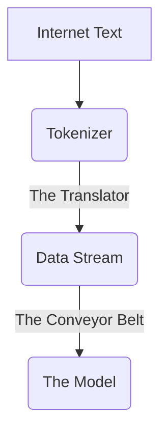

# KhanhLLM: Building my first Language Model


## 🏰 The Core Philosophy ("Lego Castle" Architecture)

I developed the framework for this training efficiency using a **"Lego Castle" metaphor**, building a massive structure on a compact foundation by only constructing what is necessary, when it is necessary, i brainstorm my idea first, then rephrase this readme using AI to make my idea clearer, by asking AI how to train a LLM and use a metaphor to help me easier to understand the whole concept.

Here is how my core ideas translate into the AI terminology used in this project:

### 1. "The Hidden Rooms"
> *Idea: "When user want to see the castle i only show the front face... unless they specify... then they can only see those things."*

*   **Implementation:** **Sparse Mixture-of-Experts (MoE)**
*   **How it works:** Instead of activating the entire brain for every word, the model uses a "Router" to select only the top 2 experts (specific rooms) out of 8 to handle the current token.
*   **Research Paper:** [Shazeer et al., 2017 - Outrageously Large Neural Networks](https://arxiv.org/abs/1701.06538)

### 2. "Temporary Walls"
> *Idea: "When showing the castle don't keep every temporary wall only rebuild if needed."*

*   **Implementation:** **Activation Checkpointing**
*   **How it works:** Instead of storing all intermediate calculations ("temporary walls") in memory, we delete them to save massive space ("ignoring gravity") and strictly rebuild (recompute) them only when needed during the backward pass.
*   **Reference:** [Chen et al., 2016 - Training Deep Nets with Sublinear Memory Cost](https://arxiv.org/abs/1604.06174)

### 3. "The Shelf"
> *Idea: "Build certain type/parts of the castle first, then temporary store in the shelf... then assemble them together."*

*   **Implementation:** **Gradient Accumulation**
*   **The Metaphor:** Imagine you want to build a huge wall, but your hands are small (Low VRAM). If you place one Lego brick at a time, the wall might be crooked.
    *   **Normal Way:** Pick up 1 brick, place it, repeat. (Unstable, crooked wall).
    *   **Gradient Accumulation:** Pick up 1 brick, put it in a bucket ("The Shelf"). Repeat 64 times. Then, take the full bucket and place 64 bricks at once.
*   **Result:** You simulate having "Giant Hands" (Large Batch Size) even though you only have small hands. This makes the training stable and the wall straight.

### 4. "The Upside-Down Pyramid"
> *Idea: "Build small foundation then build up like upside down pyramid."*

*   **Implementation:** **8-Bit Quantized Optimization**
*   **How it works:** By using `AdamW8bit`, we compress the "foundation" (optimizer states) by 75%. This allows a consumer-grade GPU (small foundation) to support a massive 692-million parameter model (upside-down pyramid).
*   **Reference:** [Dettmers et al., 2022 - 8-bit Optimizers](https://arxiv.org/abs/2110.02861)

---

## 🧠 System Architecture & Design Flow
This system was built in layers, starting from the smallest unit (data) to the full training loop. Here is the step-by-step design flow.

### 1. The Raw Material: Data Pipeline
Before the model can learn, it needs to read. We process text from the C4 (Colossal Clean Crawled Corpus) dataset.



```text
[ Internet Text ] 
       |
       v
[ Tokenizer ]  <-- "The Translator"
       |           Converts words into numbers (tokens).
       |           Ex: "Hello world" -> [101, 2055]
       v
[ Data Stream ] <-- "The Conveyor Belt"
       |            Continuously feeds small batches of numbers
       |            to the model so it never runs out of memory.
       v
[ The Model ]
```

### 2. The Core Logic: The "Expert" System
This is the unique part of this project. Instead of a standard Feed-Forward Network (FFN), we use a **MoE Layer**.

**Analogy:** Imagine a hospital. Instead of one general doctor trying to know everything, you have a **Receptionist (Router)** and **8 Specialists (Experts)**.

**Flow Diagram of One Layer:**

```text
       [ Input Token ] (e.g., The word "Apple")
              |
              v
      +-------+-------+
      |   The Router  |  <-- "The Receptionist"
      +-------+-------+
              | Decides: "This looks like a food word.
              |           Send to Expert 1 and Expert 4."
              |
      +-------+-------+
      |               |
[ Expert 1 ] ... [ Expert 8 ]  <-- "The Specialists"
(Food Spec.)      (Tech Spec.)
      |               |
      +-------+-------+
              |
              v
      [ Weighted Sum ] <-- Combine answers from the chosen experts.
              |
      [ Output Vector ]
```

**The "Rich Get Richer" Fix:**
To stop the Router from being lazy and sending *every* patient to Expert 1 (which would make Expert 1 overworked and the others useless), we added a **Load Balancing System** (based on Google Switch Transformer).
*   **Rule:** If the Receptionist sends too many people to one doctor, they get penalized (Higher Loss).
*   **Result:** The Receptionist learns to distribute work evenly.

### 3. The Full Model Structure (The "Skyscraper")
We stack these layers on top of each other to create deep understanding.

```text
[ Input ]
    |
[ Embeddings ] (Turn token IDs into rich vectors)
    |
    +--- [ Layer 1: Standard Dense Block ] (Basic processing)
    |
    +--- [ Layer 2: MoE Block ] (Specialized processing)
    |
    +--- [ Layer 3: Standard Dense Block ]
    |
    +--- [ Layer 4: MoE Block ]
    |
   ... (Repeats for 14 Layers) ...
    |
[ Output Head ] (Predicts the probability of the NEXT word)
```

---

## ⚙️ Training Process

How does the model actually learn? We use a loop that repeats millions of times.

```text
   START
     |
     v
[ 1. Get Batch ] ---<--- Load 64 sentences of text
     |
     v
[ 2. Forward Pass ] ---> Model makes a guess.
     |                   "The cat sat on the..." -> Model guesses "Moon" (Wrong)
     v
[ 3. Calculate Loss ] -> Compare guess to reality ("Mat").
     |                   Error = High.
     |                   PLUS: Add "Balancing Penalty" if experts were uneven.
     v
[ 4. Backward Pass ] --> Calculate blame.
     |                   "Who made the mistake? Router? Expert 5?"
     v
[ 5. Update Weights ] -> Nudge the math so next time it's closer to "Mat".
     |
     v
[ 6. Save/Log ] -------> Save progress to CSV and Checkpoint file.
     |
     v
   REPEAT (Go to Step 1)
```

---

## 🚨 Critical Implementation Note: "The Crystal Ball" Bug
*(Documenting a critical fix applied during development)*

**The Error:**
During initial training, the loss dropped suspiciously low (to ~0.13) almost immediately.

**The Cause:**
The model was missing a **Causal Attention Mask**. Without this mask, the Attention mechanism allowed the model to "see the future." When predicting word #5, it could look ahead at words #6, #7, etc. It wasn't learning to predict; it was learning to copy the answer key.

**The Fix:**
I added a `torch.triu` (Upper Triangular) mask filled with `-inf` to the `KhanhLLM` forward pass. This effectively "blindfolds" the model from seeing any future tokens, forcing it to actually learn language patterns.

**The Result:**
Loss will now start much higher (~10.0) and decrease slowly. This is the correct behavior for real learning.

---

## 🚀 Performance Optimizations (PyTorch 2.x)

To ensure maximum training speed on modern GPUs (Nvidia 30-series/40-series/A100), we utilize specific PyTorch 2.0+ features:

### 1. `torch.compile()`
*   **What it is:** Just-In-Time (JIT) compilation that fuses PyTorch operations into optimized CUDA kernels.
*   **Impact:** Provides free **10-30% speedup** in training throughput by reducing Python overhead and memory access.
*   **Code:** `model = torch.compile(model)`

### 2. TF32 (TensorFloat-32)
*   **What it is:** A math mode on Nvidia Ampere+ GPUs that uses 19 bits for matrix multiplication instead of the standard 32.
*   **Impact:** Massive speed increase (close to FP16) with precision comparable to FP32 for deep learning tasks.
*   **Code:** 
    ```python
    torch.backends.cuda.matmul.allow_tf32 = True
    torch.backends.cudnn.allow_tf32 = True
    ```

### 3. Flash Attention 2
*   **What it is:** A memory-efficient attention algorithm that scales linearly with sequence length.
*   **Implementation:** Automatically triggered by `nn.MultiheadAttention` in PyTorch 2.0+ when running on supported hardware.

---

## 🧠 Model Specifications

| Feature | Value |
| :--- | :--- |
| **Total Parameters** | **~692 M** |
| **Model Type** | Hybrid Decoder-Only Transformer |
| **Layers** | 14 Total (7 Dense, 7 MoE) |
| **Hidden Dimension** | 1024 |
| **Attention Heads** | 16 |
| **Context Length** | 2048 Tokens |
| **Vocabulary Size** | 50,000 (Custom BPE) |

---

## 🚀 Quick Start

1.  **Install Requirements:** `pip install torch transformers datasets bitsandbytes`
2.  **Build Tokenizer:** `python scripts/build_tokenizer.py`
3.  **Start Training:** `python scripts/train.py`
4.  **Monitor:** Check `training_log.csv` or watch the terminal output.

---

## Notes:
- FP32, FP16, BF16, INT8 are numerical data formats used in deep learning, representing different levels of precision (bits) for numbers.
https://ralphmao.github.io/ML-software-system/
- This project implements a sophisticated Language Model using a **Mixture of Experts (MoE)** architecture. Think of it not as one giant brain, but as a team of specialists working together.

